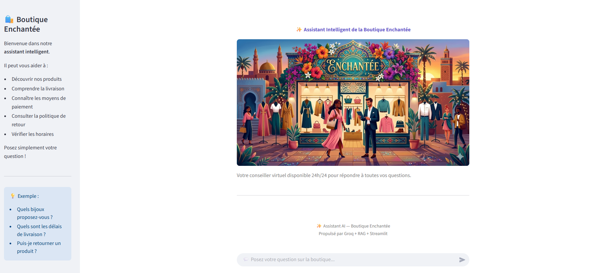

## Chatbot RAG – Boutique Enchantée

Ce projet est un **chatbot intelligent basé sur RAG (Retrieval-Augmented Generation)** qui répond aux questions des utilisateurs à partir d'une documentation sur une boutique fictive appelée **La Boutique Enchantée**.

L'application utilise **LangChain, HuggingFace Embeddings, ChromaDB, Groq et Streamlit** pour créer un assistant conversationnel simple et interactif.

---

## ⚡ Fonctionnalités

-  Interface de chat interactive avec **Streamlit**
-  Recherche sémantique dans les documents
-  Génération de réponses avec **Groq LLM**
- Affichage des **sources utilisées**
-  Système **RAG (Retrieval-Augmented Generation)**

---

## 🖥️ Interface de l'application




---


# ⚙️ Installation

### 1️⃣ Cloner le projet

```bash
git clone https://github.com/ghofran190/rag-boutique_fictive.git
cd rag-boutique_fictive
``` 


2️⃣ Installer les dépendances
```bash
pip install -r requirements.txt
```
3️⃣ Ajouter la clé API

Créer un fichier .env :
```bash
GROQ_API_KEY=votre_cle_api
```
4️⃣ Lancer l'application
```bash
streamlit run app.py
```

## 🛠️ Technologies utilisées

### LLM & API
Groq API — sert le LLM gratuitement
LLaMA 3 8B — modèle qui génère les réponses
#### Embeddings & Recherche
Sentence-Transformers — convertit le texte en vecteurs
all-MiniLM-L6-v2 — modèle d'embeddings léger et local
Scikit-learn — calcul de similarité cosinus
NumPy — manipulation des vecteurs
#### Interface
Streamlit — UI web interactive
#### Environnement
Python 3.10+
venv — isolation des dépendances
VS Code — IDE
#### Données
documentation_boutique.txt — source de connaissance externe (le "R" du RAG)


#### 👩‍💻 Auteur

Ghofran


